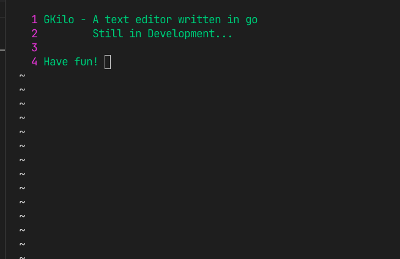

# Gkilo

An simple terminal based editor written in go!
Inspired by [Kilo Editor](https://github.com/antirez/kilo)

## INSTRUCTIONS

- To use this editor in your terminal you must run `source install.sh` in your root directory

- After that you can just run `gkilo` or `gkilo {filename}` to open and edit your file!

## COMMANDS

The default mode don't allow editing, so you must type a command key

- `e`: to edit
- `w` : to write the file
- `q` : to quit

## FEATURES

You can customize your editor editing the file `config.json`

We have the follow colors available:

    blue
    lightblue
    green
    lightgreen
    black
    default
    magenta
    lightmagenta
    red
    lightred
    white

In the config file `fg` stands for `foreground` and `bg` for `background`
